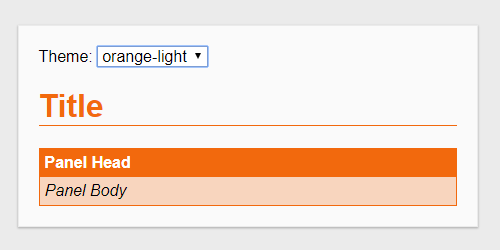

# SCSS Themes

> _Configure color themes with SCSS and apply them to HTML very easily._



Try it out [here](https://alexscheitlin.github.io/scss-themes).

## How to Use

### 1. Define colors

Define all theme colors in SCSS.

```scss
$colors: (
    red: rgb(206, 0, 27),
    blue: rgb(47, 71, 146),
);
```

### 2. Create styles

Create styles with SCSS as usual and include the `theme-color` mixin by specifying the attribute to set the theme colors and optionally setting the color opacity.

```scss
h1 {
    border-bottom: 1px solid;
    font-size: 2rem;

    @include theme-color('color');
    @include theme-color('border-color', 0.5);
}
```

### 3. Compile SCSS

Compile the SCSS to CSS. For every element where the mixin is used a style is created for all the specified colors.

```css
h1 {
  border-bottom: 1px solid;
  font-size: 2rem;
}

body.red h1 {
  color: #ce001b;
}

body.blue h1 {
  color: #2f4792;
}

body.red h1 {
  border-color: #ce001b;
}

body.blue h1 {
  border-color: #2f4792;
}
```

### 4. Use styles

Use the styles in HTML and set a theme color by adding the color as a class to the body element.

```html
<body class="red">
    <h1>Title</h1>
</body>
```

## Authors

- **Alex Scheitlin** - *Initial work* - [alexscheitlin](https://github.com/alexscheitlin)
- **Roland Schläfli** - *Initial work* - [rschlaefli](https://github.com/rschlaefli)

## License

This project is licensed under the [MIT License](LICENSE).